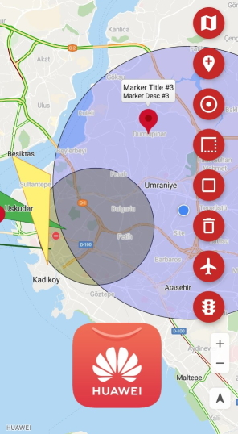
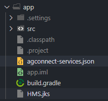

#   Huawei Map Kit Flutter Plugin



## Table of Contents
* [Introduction](#introduction)
* [Installation Guide](#installation-guide)
* [API Reference](#api-reference)
* [Configuration Description](#configuration-description)
* [Licensing and Terms](#licensing-and-terms)

## Introduction

This plugin enables communication between Huawei Map SDK and Flutter platform. Huawei Map Kit, provides standard maps as well as UI elements such as markers, shapes, and layers for you to customize maps that better meet service scenarios. Enables users to interact with a map in your app through gestures and buttons in different scenarios.

Huawei Map Kit provides the following core capabilities:
- **Huawei Map**: Core map component with tons of features.
- **My Location**: Your location on the map.
- **Markers**: Adding markers on the map with tons of modifications with their InfoWindow component.
- **Polylines**: Adding polylines on the map with tons of modifications.
- **Polygons**: Adding polygons on the map with tons of modifications.
- **Circles**: Adding circles on the map with tons of modifications.

## Installation Guide

- Before you get started, you must register as a HUAWEI developer and complete identity verification on the [HUAWEI Developer](https://developer.huawei.com/consumer/en/) website. For details, please refer to [Register a HUAWEI ID](https://developer.huawei.com/consumer/en/doc/10104).

- Create an app by referring to [Creating an AppGallery Connect Project](https://developer.huawei.com/consumer/en/doc/development/AppGallery-connect-Guides/agc-get-started#h1-1587521853252) and [Adding an App to the Project](https://developer.huawei.com/consumer/en/doc/development/AppGallery-connect-Guides/agc-get-started#h1-1587521946133).

- A signing certificate fingerprint is used to verify the authenticity of an app when it attempts to access an HMS Core (APK) through the HMS SDK. Before using the HMS Core (APK), you must locally generate a signing certificate fingerprint and configure it in AppGallery Connect.  For details, please refer to [Generating a Signing Certificate](https://developer.huawei.com/consumer/en/codelab/HMSPreparation/index.html#3).

- Sign in to [AppGallery Connect](https://developer.huawei.com/consumer/en/service/josp/agc/index.html) and select **My apps**. Then, on the **Project Setting** page, set **SHA-256 certificate fingerprint** to the SHA-256 fingerprint from [Generating a Signing Certificate Fingerprint](https://developer.huawei.com/consumer/en/doc/development/HMS-Guides/hms-site-configuringagc#h3).

- In [AppGallery Connect](https://developer.huawei.com/consumer/en/service/josp/agc/index.html), on **My apps** page, find your app from the list and click the app name. Go to **Development > Overview > App Information**. Click **agconnect-service.json** to download configuration file. 


- Copy the **agconnect-service.json** file to the **android/app** directory.
  

- Open the **build.gradle** file in the **android** directory of your project.
    - Go to **buildscript** then configure the Maven repository address and agconnect plugin for the  HMS SDK.

        ```gradle
        buildscript {
            repositories {
                google()
                jcenter()
                maven { url 'https://developer.huawei.com/repo/' }
            }

            dependencies {
                /* 
                 * <Other dependencies>
                 */
                classpath 'com.huawei.agconnect:agcp:1.2.1.301'
            }
        }
        ```

    - Go to **allprojects** then configure the Maven repository address for the  HMS SDK.

        ```gradle
        allprojects {
            repositories {
                google()
                jcenter()
                maven { url 'https://developer.huawei.com/repo/' }
            }
        }
        ```

    - Open the **build.gradle** file in the **android/app** directory.

  
    - Add `apply plugin: 'com.huawei.agconnect'` line after the `apply plugin: 'com.android.application'` line.

        ```gradle
        apply plugin: 'com.android.application'
        apply plugin: 'com.huawei.agconnect'
        apply from: "$flutterRoot/packages/flutter_tools/gradle/flutter.gradle"
        ```

    - Set your package name in **defaultConfig** > **applicationId**. Package name must match with the **package_name** entry in **agconnect-services.json** file.
        ```gradle
        defaultConfig {
                applicationId "<package_name>"
                /*
                 * <Other configurations>
                 */
            }
        ```

    - Copy the signature file that generated in [Generating a Signing Certificate](https://developer.huawei.com/consumer/en/codelab/HMSPreparation/index.html#3) to **android/app** directory.

    - Configure the signature in **android** according to the signature file information.

        ```gradle
        android {
            /*
             * <Other configurations>
             */

            signingConfigs {
                config {
                    storeFile file('<keystore_file>')
                    storePassword '<keystore_password>'
                    keyAlias '<key_alias>'
                    keyPassword '<key_password>'
                }
            }

            buildTypes {
                debug {
                    signingConfig signingConfigs.config
                }
                release {
                    signingConfig signingConfigs.config
                }
            }
        }
        ```
- Check whether the agconnect-services.json and signature file are successfully added to your project.

    

- On your Flutter project directory find and open your **pubspec.yaml** file and add library to dependencies.

    ```yaml
    dependencies:
        huawei_map:
            # Replace {library path} with actual library path of Huawei Map Kit Flutter Plugin. (ex: ../)
            path: {library path}
    ```

- Run

    ```sh
    flutter pub get
    ```
    **or**

    From Android Studio/IntelliJ: Click **Packages get** in the action ribbon at the top of pubspec.yaml.
    From VS Code: Click **Get Packages** located in right side of the action ribbon at the top of pubspec.yaml.

- Add a corresponding *import* statement in the Dart code and start the app.
    ```dart
    import 'package:huawei_map/map.dart';
    ```


## API Reference

|          Class          |                                   Description                                    |
|:-----------------------:|:--------------------------------------------------------------------------------:|
|       BitmapDescriptor        | Defines a bitmap image. A bitmap image can be used for a marker icon. |
|       CameraPosition        | A class that encapsulates all camera attributes. |
|       CameraTargetBounds        | A class that encapsulates bound attribute. |
|       CameraUpdate        | Defines a camera move. |
|       Cap        | Defines a cap that is applied at the start or end vertex of a polyline. |
|       Circle        | Defines a circle on a map. |
|       CircleId        | Represents the immutable circleId |
|       HuaweiMap        | A main class of the HUAWEI Map Kit SDK. |
|       HuaweiMapOptions        | This class defines attributes for a HuaweiMap object. |
|       InfoWindow        | Defines an InfoWindow. |
|       JointType        | Defines the joint type for a polyline or the outline of a polygon. |
|       LatLng        | Represents the longitude and latitude, in degrees. |
|       LatLngBounds        | Represents a longitude/latitude aligned rectangle. |
|       Marker        | Defines an icon placed at a specified position on a map. |
|       MarkerId        | Represents the immutable markerId |
|       MinMaxZoomPreference        | A class that encapsulates min and max zoom attributes. |
|       PatternItem        | An immutable class that describes the stroke pattern of a polyline or the outline of a polygon or circle. |
|       Polygon        |  Defines a polygon on a map. |
|       PolygonId        | Represents the immutable polygonId |
|       Polyline        |  Defines a polyline on a map. |
|       PolylineId        | Represents the immutable polylineId |
|       ScreenCoordinate        | A class that encapsulates x and y attributes. |


You can read more and get detailed information about the interfaces described above from [developer.huawei.com](https://developer.huawei.com)

## Configuration Description

No.

## Licensing and Terms

Huawei Map Kit Flutter SDK uses the Apache 2.0 license.